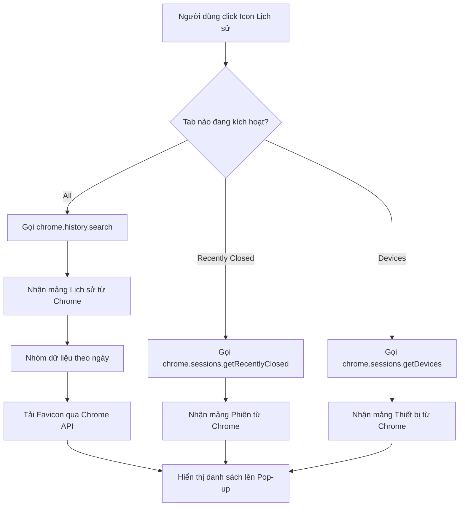
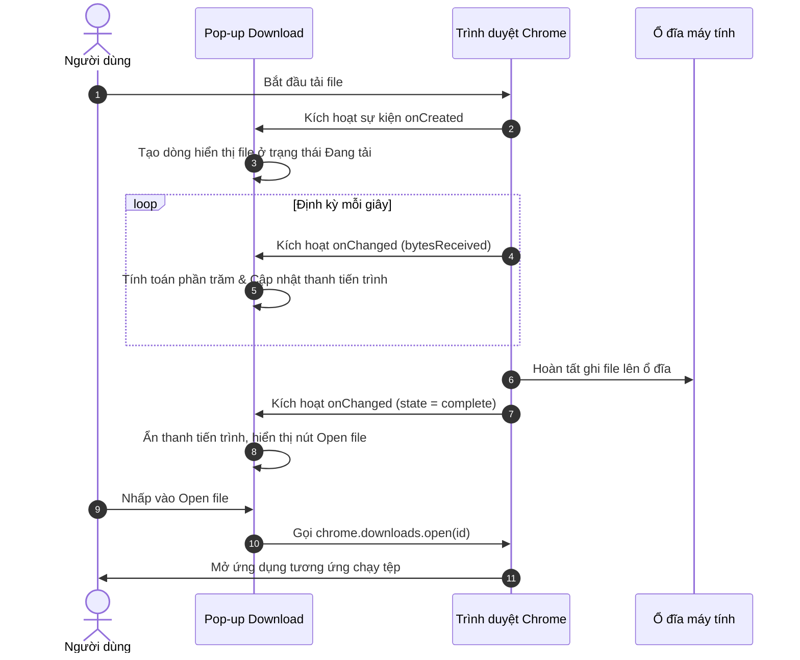

# Tài liệu Kiến trúc Hệ thống (System Architecture)

Tài liệu này mô tả kiến trúc hệ thống và luồng xử lý của bộ đôi tiện ích mở rộng Chrome bao gồm: EdgeHistoryPopup và EdgeDownloadsPopup.

---

## 1. Tổng quan hệ thống (System Overview)
Hệ thống là một tập hợp gồm 2 Chrome Extensions độc lập, được đóng gói dưới dạng các thư mục riêng lẻ để nạp vào Chrome. Chúng được thiết kế để mở rộng tính năng điều hướng và quản lý của trình duyệt, cung cấp cho người dùng giao diện mượt mà phong cách Fluent Design để truy cập nhanh Lịch sử (History) và Lượt tải xuống (Downloads).

---

## 2. Công nghệ sử dụng (Tech Stack)
- **Cốt lõi**: HTML5, Vanilla JavaScript (ES6+), và Chrome Extension Manifest V3 APIs.
- **Giao diện & Phong cách**: CSS3 (Biến CSS, Flexbox, Bố cục lưới, Hiệu ứng kính mờ `backdrop-filter`).
- **Tài nguyên đồ họa**: Ảnh biểu tượng vector SVG nhúng trực tiếp.
- **Trình duyệt mục tiêu**: Google Chrome và các trình duyệt nhân Chromium phiên bản hỗ trợ Manifest V3.

---

## 3. Cấu trúc thư mục (Folder Structure)

```markdown
d:/CodePython/CustomeExtensionForChrome/
├── README.md                           # Hướng dẫn sử dụng & cài đặt tổng quan
├── docs/
│   ├── architecture.md                 # Tài liệu kiến trúc hệ thống này
│   └── CHANGELOG.md                    # Nhật ký thay đổi phiên bản
├── EdgeHistoryPopup/                   # Extension Lịch sử phong cách Edge
│   ├── manifest.json                   # Cấu hình extension lịch sử
│   ├── popup.html                      # Giao diện popup lịch sử
│   ├── popup.css                       # Kiểu giao diện tối Fluent
│   ├── popup.js                        # Logic truy vấn & xử lý lịch sử
│   └── icon.svg                        # Icon tiện ích Lịch sử (SVG)
└── EdgeDownloadsPopup/                 # Extension Lượt tải xuống phong cách Edge
    ├── manifest.json                   # Cấu hình extension lượt tải
    ├── popup.html                      # Giao diện popup lượt tải
    ├── popup.css                       # Kiểu giao diện và progress bar
    ├── popup.js                        # Logic theo dõi & thao tác tải xuống
    └── icon.svg                        # Icon tiện ích Lượt tải (SVG)
```

---

## 4. Kiến trúc thành phần (Component Architecture)
Hệ thống chia làm hai thành phần lớn tương ứng với hai tiện ích:

1. **Thành phần Lịch sử (History Component)**:
   - Giao diện người dùng (`popup.html` & `popup.css`): Hiển thị cấu trúc tab và danh sách kết quả.
   - Trình điều khiển logic (`popup.js`): Giao tiếp với API trình duyệt (`chrome.history` và `chrome.sessions`) để lấy lịch sử, khôi phục tab đã đóng, và tương tác với các thiết bị được đồng bộ.
2. **Thành phần Tải xuống (Downloads Component)**:
   - Giao diện người dùng: Hiển thị danh sách tệp tải xuống, liên kết mở tệp và thanh tiến trình thời gian thực.
   - Trình điều khiển logic: Sử dụng `chrome.downloads` để lắng nghe quá trình tải, tính toán tiến trình (%), mở tệp vật lý, và hiển thị vị trí lưu trữ trên ổ đĩa.

---

## 5. Luồng dữ liệu (Data Flow)

### Luồng 1: Xem và tìm kiếm lịch sử duyệt web
1. Người dùng click vào icon tiện ích Lịch sử.
2. Pop-up tải dữ liệu và gọi hàm `chrome.history.search`.
3. Trình duyệt trả về danh sách lịch sử dưới dạng mảng JSON.
4. Trình điều khiển phân loại thời gian, chèn biểu tượng favicon thông qua định dạng URL nội bộ `chrome-extension://<id>/_favicon/...` và hiển thị lên danh sách.
5. Khi người dùng nhập từ khóa tìm kiếm, bộ đệm (debounce) sẽ chờ 200ms trước khi thực hiện truy vấn lại từ đầu.

### Luồng 2: Theo dõi và cập nhật tiến trình tải xuống
1. Người dùng bắt đầu tải xuống một tệp tin.
2. Trình duyệt kích hoạt sự kiện `chrome.downloads.onCreated`.
3. Tiện ích nhận sự kiện, thêm tệp tải xuống vào danh sách ở trạng thái `in_progress`.
4. Sự kiện `chrome.downloads.onChanged` liên tục kích hoạt, tiện ích đọc giá trị `bytesReceived` và `totalBytes` để tính toán phần trăm hoàn thành và cập nhật thanh tiến trình.
5. Khi hoàn tất, giao diện ẩn thanh tiến trình và hiển thị đường link mở tệp ("Open file").

---

## 6. Cơ chế bảo mật (Security Mechanisms)
- **Nguyên tắc phân quyền tối thiểu (Least Privilege)**: Mỗi extension chỉ yêu cầu các quyền thực sự cần thiết trong `manifest.json`.
- **Favicon bảo mật**: Sử dụng đường dẫn Favicon an toàn nội bộ của trình duyệt Chrome Manifest V3 thay vì gửi URL trang web cho các dịch vụ bên thứ ba để đảm bảo quyền riêng tư của người dùng.
- **Môi trường Sandbox**: Toàn bộ mã nguồn chạy trong môi trường bảo mật độc lập của Chrome, bảo vệ hệ điều hành khỏi các tương tác độc hại.

---

## 7. APIs / Routes cốt lõi (Core APIs/Routes)
Hệ thống sử dụng các API gốc của trình duyệt Chrome:
- `chrome.history.search`: Truy vấn lịch sử duyệt web.
- `chrome.history.deleteUrl`: Xóa một URL khỏi lịch sử của trình duyệt.
- `chrome.sessions.getRecentlyClosed`: Lấy danh sách các tab/cửa sổ đã đóng gần đây.
- `chrome.sessions.restore`: Khôi phục một phiên làm việc đã đóng.
- `chrome.sessions.getDevices`: Lấy danh sách tab đang mở trên các thiết bị khác đang đồng bộ tài khoản Chrome.
- `chrome.downloads.search`: Lấy danh sách lịch sử tải xuống.
- `chrome.downloads.getFileIcon`: Lấy biểu tượng thực tế của tệp tin từ hệ thống dựa trên phần mở rộng hoặc đường dẫn tệp.
- `chrome.downloads.open`: Mở tệp tin đã tải xuống hoàn thành.
- `chrome.downloads.show`: Hiển thị vị trí tệp tin trong thư mục lưu trữ (File Explorer).
- `chrome.downloads.erase`: Xóa tệp tin khỏi lịch sử tải xuống.
- `chrome.downloads.showDefaultFolder`: Mở thư mục tải xuống mặc định của hệ điều hành.

---

## 8. Sơ đồ trực quan (Visual Diagrams)

### Sơ đồ 1: Luồng xử lý lấy và lọc lịch sử duyệt web (Flowchart)


### Sơ đồ 2: Trình tự cập nhật tiến trình tải xuống thời gian thực (Sequence Diagram)

