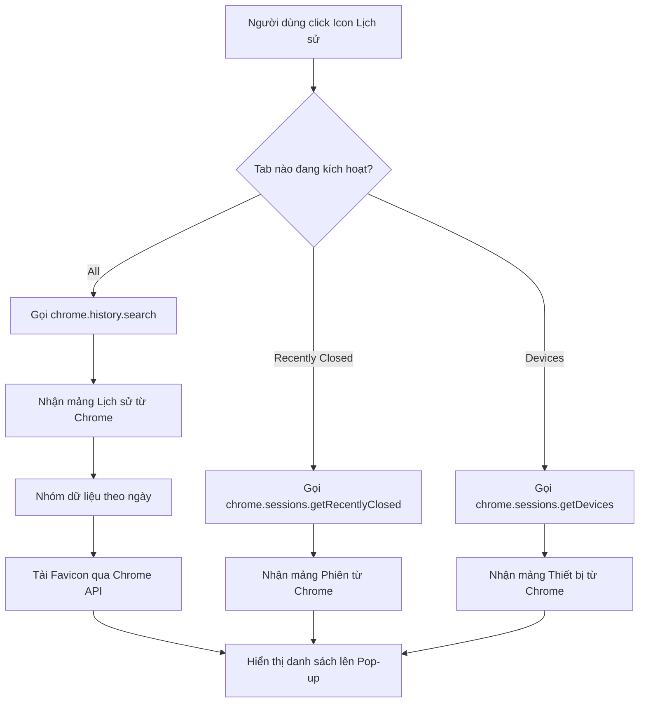
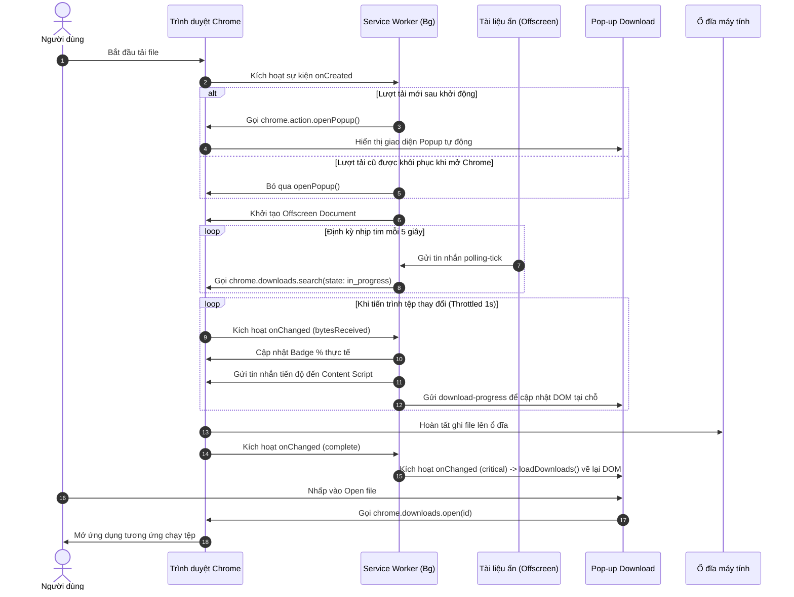

# Tài liệu Kiến trúc Hệ thống (System Architecture)

Tài liệu này mô tả kiến trúc hệ thống và luồng xử lý của bộ đôi tiện ích mở rộng Chrome bao gồm: EdgeHistoryPopup và EdgeDownloadsPopup.

---

## 1. Tổng quan hệ thống (System Overview)
Hệ thống là một tập hợp gồm 2 Chrome Extensions độc lập, được đóng gói dưới dạng các thư mục riêng lẻ để nạp vào Chrome. Chúng được thiết kế để mở rộng tính năng điều hướng và quản lý của trình duyệt, cung cấp cho người dùng giao diện mượt mà phong cách Fluent Design để truy cập nhanh Lịch sử (History) và Lượt tải xuống (Downloads).

---

## 2. Công nghệ sử dụng (Tech Stack)
- **Cốt lõi**: HTML5, Vanilla JavaScript (ES6+), và Chrome Extension Manifest V3 APIs.
- **Giao diện & Phong cách**: CSS3 (Biến CSS, Flexbox, Bố cục lưới, Hiệu ứng kính mờ `backdrop-filter`).
- **Tài nguyên đồ họa**: Ảnh biểu tượng vector SVG nhúng trực tiếp.
- **Trình duyệt mục tiêu**: Google Chrome và các trình duyệt nhân Chromium phiên bản hỗ trợ Manifest V3.

---

## 3. Cấu trúc thư mục (Folder Structure)

```markdown
d:/CodePython/CustomeExtensionForChrome/
├── README.md                           # Hướng dẫn sử dụng & cài đặt tổng quan
├── docs/
│   ├── architecture.md                 # Tài liệu kiến trúc hệ thống này
│   └── CHANGELOG.md                    # Nhật ký thay đổi phiên bản
├── EdgeHistoryPopup/                   # Extension Lịch sử phong cách Edge
│   ├── manifest.json                   # Cấu hình extension lịch sử
│   ├── popup.html                      # Giao diện popup lịch sử
│   ├── popup.css                       # Kiểu giao diện tối Fluent
│   ├── popup.js                        # Logic truy vấn & xử lý lịch sử
│   ├── icon.svg                        # Icon gốc dạng SVG
│   ├── icon16.png                      # Icon kích thước 16x16
│   ├── icon32.png                      # Icon kích thước 32x32
│   ├── icon48.png                      # Icon kích thước 48x48
│   └── icon128.png                     # Icon kích thước 128x128
└── EdgeDownloadsPopup/                 # Extension Lượt tải xuống phong cách Edge
    ├── manifest.json                   # Cấu hình extension lượt tải
    ├── popup.html                      # Giao diện popup lượt tải
    ├── popup.css                       # Kiểu giao diện và progress bar
    ├── popup.js                        # Logic theo dõi & thao tác tải xuống
    ├── background.js                   # Service Worker quản lý vòng đời tải xuống và vẽ Canvas
    ├── offscreen.html                  # HTML chứa script offscreen để polling tiến độ ngầm
    ├── offscreen.js                    # Logic offscreen chạy polling liên tục không bị ngủ đông
    ├── content.js                      # Content Script hiển thị hoạt ảnh Toast Fluent
    ├── icon.svg                        # Icon gốc dạng SVG (trắng)
    ├── icon16.png                      # Icon trắng kích thước 16x16
    ├── icon32.png                      # Icon trắng kích thước 32x32
    ├── icon48.png                      # Icon trắng kích thước 48x48
    ├── icon128.png                     # Icon trắng kích thước 128x128
    ├── icon_glow.svg                   # Icon phát sáng dạng SVG (xanh Fluent)
    ├── icon_glow16.png                 # Icon xanh kích thước 16x16
    ├── icon_glow32.png                 # Icon xanh kích thước 32x32
    ├── icon_glow48.png                 # Icon xanh kích thước 48x48
    └── icon_glow128.png                # Icon xanh kích thước 128x128
```

---

## 4. Kiến trúc thành phần (Component Architecture)
Hệ thống chia làm hai thành phần lớn tương ứng với hai tiện ích:

1. **Thành phần Lịch sử (History Component)**:
   - Giao diện người dùng (`popup.html` & `popup.css`): Hiển thị cấu trúc tab và danh sách kết quả.
   - Trình điều khiển logic (`popup.js`): Giao tiếp với API trình duyệt (`chrome.history` và `chrome.sessions`) để lấy lịch sử, khôi phục tab đã đóng, và tương tác với các thiết bị được đồng bộ.
2. **Thành phần Tải xuống (Downloads Component)**:
   - Giao diện người dùng (`popup.html`, `popup.css`, `popup.js`): Hiển thị danh sách tải xuống, hỗ trợ chế độ thu gọn phiên hiện tại kết hợp nút "See more" để mở rộng, mở tệp, hiển thị vị trí và xóa lịch sử tải xuống. Popup nhận tin nhắn tiến trình từ Service Worker qua `chrome.runtime.onMessage` để cập nhật DOM tại chỗ theo mô hình event-driven, đồng thời chỉ vẽ lại danh sách khi có thay đổi trạng thái quan trọng.
   - Service Worker (`background.js`): Chạy ngầm để quản lý vòng đời tải xuống, tắt UI mặc định của Chrome, xử lý trạng thái hoàn tất bằng vẽ Canvas checkmark Fluent, và điều phối đóng/mở tài liệu offscreen. Đồng thời giới hạn tần suất gửi tin nhắn cập nhật tiến trình (Throttling) tối đa 1 giây/lần rồi phát dữ liệu đến cả Content Script và Popup.
   - Tài liệu ẩn (`offscreen.html`, `offscreen.js`): Môi trường DOM ẩn phát nhịp tim (heartbeat) định kỳ 5 giây bằng tin nhắn `'polling-tick'` để duy trì hoạt động cho Service Worker mà không bị Chrome dừng Service Worker.
   - Content Script (`content.js`): Chèn Card Fluent Toast bọc Shadow DOM độc lập để hiển thị tiến trình hình tròn và hiệu ứng nổ hạt hoàn tất trên trang web đang active. Sử dụng `requestAnimationFrame` và cập nhật DOM tại chỗ để hoạt ảnh tiến trình cực kỳ mượt mà.

---

## 5. Luồng dữ liệu (Data Flow)

### Luồng 1: Xem và tìm kiếm lịch sử duyệt web
1. Người dùng click vào icon tiện ích Lịch sử.
2. Pop-up tải dữ liệu và gọi hàm `chrome.history.search`.
3. Trình duyệt trả về danh sách lịch sử dưới dạng mảng JSON.
4. Trình điều khiển phân loại thời gian, chèn biểu tượng favicon thông qua định dạng URL nội bộ `chrome-extension://<id>/_favicon/...` và hiển thị lên danh sách.
5. Khi người dùng nhập từ khóa tìm kiếm, bộ đệm (debounce) sẽ chờ 200ms trước khi thực hiện truy vấn lại từ đầu. Mỗi truy vấn được gắn mã định danh hiện hành để callback bất đồng bộ cũ không thể ghi đè kết quả mới hơn.

### Luồng 2: Theo dõi và cập nhật tiến trình tải xuống
1. Người dùng bắt đầu tải xuống một tệp tin.
2. Trình duyệt kích hoạt sự kiện `chrome.downloads.onCreated`.
3. Background Service Worker nhận sự kiện, tự động thiết lập vô hiệu hóa bong bóng tải gốc bằng `setUiOptions`, lưu ID tệp tải vào danh sách phiên làm việc hiện tại (`sessionDownloadIds`), và chỉ gọi `chrome.action.openPopup()` nếu đây là lượt tải mới sau giai đoạn khởi động. Các lượt tải cũ do Chrome khôi phục khi vừa mở trình duyệt sẽ không tự bật popup. Sau đó Service Worker khởi động hoạt ảnh nhấp nháy phát sáng (glow icon) và gọi `ensureOffscreenDocument()` để kích hoạt tài liệu ẩn Offscreen.
4. Tài liệu Offscreen hoạt động và gửi tin nhắn `'polling-tick'` định kỳ mỗi 5 giây để đánh thức và giữ cho Service Worker luôn hoạt động.
5. Service Worker nhận sự kiện thay đổi qua `chrome.downloads.onChanged` và tiến hành cập nhật bộ nhớ đệm `activeDownloads`. Khi tiến trình thay đổi liên tục, background giới hạn tần suất gửi tin nhắn (throttling) tối đa 1 giây/lần cho mỗi tệp tải để giảm tải CPU.
6. Khi popup đang mở, `popup.js` lắng nghe tin nhắn `download-progress` từ Service Worker và cập nhật trực tiếp nhãn phần trăm, dung lượng, thanh tiến trình và trạng thái Pause/Resume của dòng tương ứng. Trình lắng nghe `onChanged` trong popup được lọc để chỉ gọi `loadDownloads()` (vẽ lại DOM) khi có thay đổi trạng thái quan trọng.
7. Content Script nhận tin nhắn tiến độ, cập nhật DOM tại chỗ của card Fluent Toast thông qua `requestAnimationFrame` hiển thị tiến trình xoay tròn Circular Progress mượt mà.
8. Khi hoàn tất, Service Worker gửi tin nhắn hoàn thành, kích hoạt hoạt ảnh hạt màu nổ (particle explode) trên card Toast của Content Script, tự động biến mất sau 5 giây. Đồng thời, nếu cửa sổ popup không mở, Service Worker sẽ vẽ động biểu tượng hoàn thành bằng cách sử dụng `OffscreenCanvas` để tạo một vòng tròn màu xanh lá cây sắc nét kèm dấu tích trắng nhỏ ở góc dưới bên phải biểu tượng, rồi đặt biểu tượng thông qua `chrome.action.setIcon`. Khi không còn tệp nào đang tải ngầm, Offscreen Document tự động đóng lại thông qua `closeOffscreenDocument()`. Biểu tượng hoàn tất này sẽ được khôi phục về mặc định ngay khi người dùng mở popup hoặc bắt đầu lượt tải mới.

### Luồng 3: Thu gọn và mở rộng danh sách tải xuống (See more)
1. Khi người dùng click biểu tượng Downloads, Popup gửi tin nhắn lấy danh sách ID của phiên (`get-session-downloads`) từ Service Worker.
2. Nếu danh sách ID phiên trống (vừa mở trình duyệt, chưa tải gì), Popup hiển thị toàn bộ lịch sử tải xuống dạng danh sách dài (State A).
3. Nếu danh sách ID phiên có dữ liệu (đã hoặc đang tải tệp trong phiên này), Popup tự động thu gọn chỉ hiển thị các tệp đang tải và các tệp trong phiên đó, đồng thời hiển thị nút "See more" ở chân trang (State B).
4. Người dùng click nút "See more": Popup đổi trạng thái (`forceShowAll = true`), hiển thị toàn bộ danh sách lịch sử tải xuống và ẩn nút "See more" đi.

---

## 6. Cơ chế bảo mật (Security Mechanisms)
- **Nguyên tắc phân quyền tối thiểu (Least Privilege)**: Mỗi extension chỉ yêu cầu các quyền thực sự cần thiết trong `manifest.json`.
- **Favicon bảo mật**: Sử dụng đường dẫn Favicon an toàn nội bộ của trình duyệt Chrome Manifest V3 thay vì gửi URL trang web cho các dịch vụ bên thứ ba để đảm bảo quyền riêng tư của người dùng.
- **Môi trường Sandbox**: Toàn bộ mã nguồn chạy trong môi trường bảo mật độc lập của Chrome, bảo vệ hệ điều hành khỏi các tương tác độc hại.

---

## 7. APIs / Routes cốt lõi (Core APIs/Routes)
Hệ thống sử dụng các API gốc của trình duyệt Chrome:
- `chrome.history.search`: Truy vấn lịch sử duyệt web.
- `chrome.history.deleteUrl`: Xóa một URL khỏi lịch sử của trình duyệt.
- `chrome.sessions.getRecentlyClosed`: Lấy danh sách các tab/cửa sổ đã đóng gần đây.
- `chrome.sessions.restore`: Khôi phục một phiên làm việc đã đóng.
- `chrome.sessions.getDevices`: Lấy danh sách tab đang mở trên các thiết bị khác đang đồng bộ tài khoản Chrome.
- `chrome.downloads.search`: Lấy danh sách lịch sử tải xuống, được gọi trong cả popup và service worker để tính toán phần trăm Badge chính xác 100%.
- `chrome.downloads.getFileIcon`: Lấy biểu tượng thực tế của tệp tin từ hệ thống dựa trên phần mở rộng hoặc đường dẫn tệp.
- `chrome.downloads.open`: Mở tệp tin đã tải xuống hoàn thành.
- `chrome.downloads.show`: Hiển thị vị trí tệp tin trong thư mục lưu trữ (File Explorer).
- `chrome.downloads.erase`: Xóa tệp tin khỏi lịch sử tải xuống.
- `chrome.downloads.showDefaultFolder`: Mở thư mục tải xuống mặc định của hệ điều hành.
- `chrome.downloads.setUiOptions`: Cấu hình tắt/bật bong bóng tải xuống mặc định của trình duyệt.
- `chrome.action.setIcon`: Thay đổi biểu tượng (icon) trên thanh công cụ động.
- `chrome.action.setBadgeText`: Cập nhật văn bản chỉ số badge (phần trăm).
- `chrome.action.openPopup`: Tự động mở cửa sổ trình đơn của tiện ích mở rộng khi người dùng bắt đầu lượt tải mới, có bộ lọc tránh bật popup cho download cũ được Chrome khôi phục lúc khởi động.
- `chrome.runtime.onMessage.addListener`: Lắng nghe tin nhắn trao đổi dữ liệu giữa các thành phần, bao gồm phản hồi thông tin tệp tải trong phiên hiện tại (`sessionDownloadIds`) để kiểm soát chế độ hiển thị thu gọn của popup và nhận dữ liệu tiến trình tải xuống event-driven.
- `chrome.tabs.onActivated`: Lắng nghe sự kiện người dùng chuyển đổi tab để đồng bộ hoạt ảnh tải xuống.

---

## 8. Sơ đồ trực quan (Visual Diagrams)

### Sơ đồ 1: Luồng xử lý lấy và lọc lịch sử duyệt web (Flowchart)


### Sơ đồ 2: Trình tự cập nhật tiến trình tải xuống thời gian thực (Sequence Diagram)

