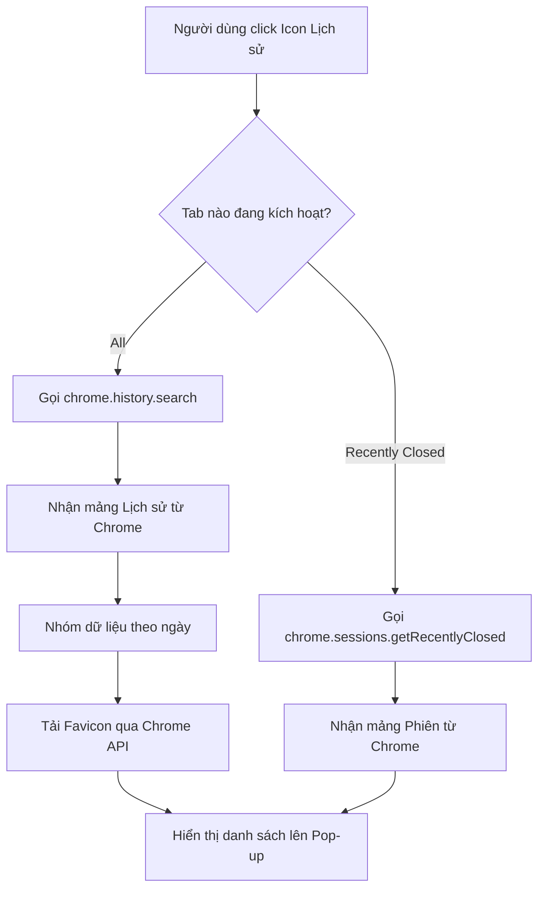
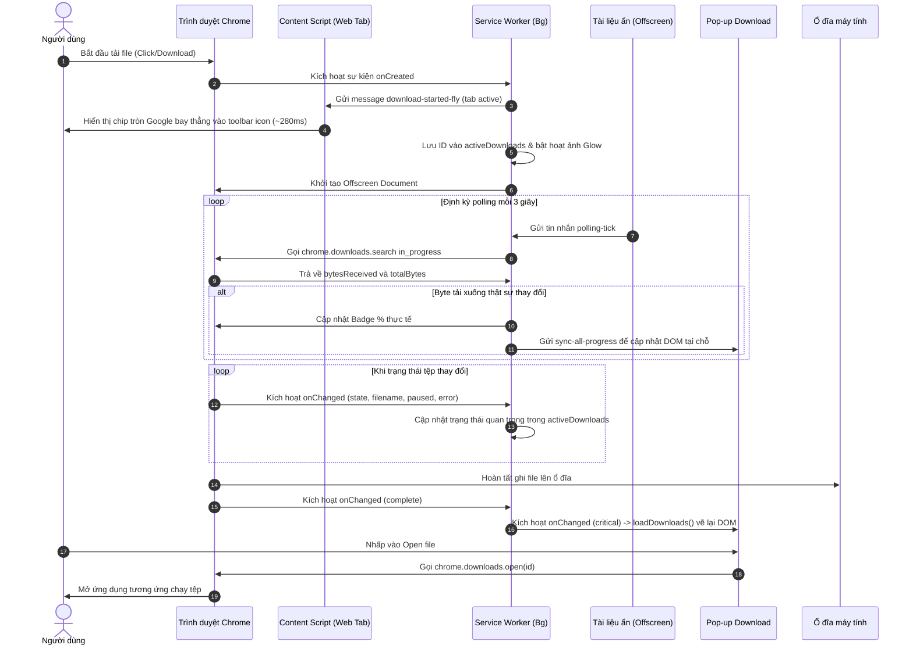

# Tài liệu Kiến trúc Hệ thống (System Architecture)

Tài liệu này mô tả kiến trúc hệ thống và luồng xử lý của bộ đôi tiện ích mở rộng Chrome bao gồm: EdgeHistoryPopup và EdgeDownloadsPopup.

---

## 1. Tổng quan hệ thống (System Overview)
Hệ thống là một tập hợp gồm 2 Chrome Extensions độc lập, được đóng gói dưới dạng các thư mục riêng lẻ để nạp vào Chrome. Chúng được thiết kế để mở rộng tính năng điều hướng và quản lý của trình duyệt, cung cấp cho người dùng giao diện mượt mà phong cách Fluent Design để truy cập nhanh Lịch sử (History) và Lượt tải xuống (Downloads).

---

## 2. Công nghệ sử dụng (Tech Stack)
- **Cốt lõi**: HTML5, Vanilla JavaScript (ES6+), và Chrome Extension Manifest V3 APIs.
- **Giao diện & Phong cách**: CSS3 (Biến CSS, Flexbox, Bố cục lưới, Hiệu ứng kính mờ `backdrop-filter`).
- **Tài nguyên đồ họa**: Ảnh biểu tượng SVG và PNG, bao gồm bộ icon trạng thái được dựng overlay bằng Canvas trong Service Worker.
- **Trình duyệt mục tiêu**: Google Chrome và các trình duyệt nhân Chromium phiên bản hỗ trợ Manifest V3.

---

## 3. Cấu trúc thư mục (Folder Structure)

```markdown
d:/CodePython/CustomeExtensionForChrome/
├── README.md                           # Hướng dẫn sử dụng & cài đặt tổng quan
├── docs/
│   ├── architecture.md                 # Tài liệu kiến trúc hệ thống này
│   └── CHANGELOG.md                    # Nhật ký thay đổi phiên bản
├── EdgeHistoryPopup/                   # Extension Lịch sử phong cách Edge
│   ├── manifest.json                   # Cấu hình extension lịch sử (v1.3.6)
│   ├── popup.html                      # Giao diện popup lịch sử
│   ├── popup.css                       # Kiểu giao diện theo Fluent Design
│   ├── popup.js                        # Logic tìm kiếm, xóa, mở trang lịch sử và tự động đồng bộ theme
│   ├── background.js                   # Service Worker quản lý vòng đời và chuyển đổi icon theo theme
│   ├── content.js                      # Content Script tự động nhận diện prefers-color-scheme trên web
│   ├── offscreen.html                  # HTML môi trường DOM ẩn đọc media query khi khởi động
│   ├── offscreen.js                    # Script đọc window.matchMedia và gửi theme-detected tức thì
│   ├── icon.svg                        # Icon gốc dạng SVG (trắng)
│   ├── icon16.png                      # Icon kích thước 16x16
│   ├── icon32.png                      # Icon kích thước 32x32
│   ├── icon48.png                      # Icon kích thước 48x48
│   ├── icon128.png                     # Icon kích thước 128x128
│   ├── icon_dark.svg                   # Icon dạng SVG nền tối (Scale 1.0) cho Chrome theme sáng
│   ├── icon_dark16.png                 # Icon nền tối kích thước 16x16
│   ├── icon_dark32.png                 # Icon nền tối kích thước 32x32
│   ├── icon_dark48.png                 # Icon nền tối kích thước 48x48
│   └── icon_dark128.png                # Icon nền tối kích thước 128x128
└── EdgeDownloadsPopup/                 # Extension Lượt tải xuống phong cách Edge
    ├── manifest.json                   # Cấu hình extension lượt tải (v1.3.6)
    ├── popup.html                      # Giao diện popup lượt tải
    ├── popup.css                       # Kiểu giao diện và progress bar
    ├── popup.js                        # Logic theo dõi & thao tác tải xuống và tự động đồng bộ theme
    ├── background.js                   # Service Worker quản lý vòng đời tải xuống và đổi icon theo theme
    ├── content.js                      # Content Script phát hiện theme và hiển thị hoạt ảnh chip bay khi tải
    ├── offscreen.html                  # HTML chứa script offscreen để polling tiến độ ngầm và đọc media query
    ├── offscreen.js                    # Logic offscreen phát tick polling và đọc window.matchMedia theme
    ├── icon.svg                        # Icon gốc dạng SVG (trắng)
    ├── icon16.png                      # Icon trắng kích thước 16x16
    ├── icon32.png                      # Icon trắng kích thước 32x32
    ├── icon48.png                      # Icon trắng kích thước 48x48
    ├── icon128.png                     # Icon trắng kích thước 128x128
    ├── icon_glow.svg                   # Icon phát sáng dạng SVG (xanh Fluent)
    ├── icon_glow16.png                 # Icon xanh kích thước 16x16
    ├── icon_glow32.png                 # Icon xanh kích thước 32x32
    ├── icon_glow48.png                 # Icon xanh kích thước 48x48
    ├── icon_glow128.png                # Icon xanh kích thước 128x128
    ├── icon_dark.svg                   # Icon dạng SVG nền tối (Scale 1.0) cho Chrome theme sáng
    ├── icon_dark16.png                 # Icon nền tối kích thước 16x16
    ├── icon_dark32.png                 # Icon nền tối kích thước 32x32
    ├── icon_dark48.png                 # Icon nền tối kích thước 48x48
    ├── icon_dark128.png                # Icon nền tối kích thước 128x128
    ├── icon_dark_glow16.png            # Icon nền tối phát sáng 16x16
    ├── icon_dark_glow32.png            # Icon nền tối phát sáng 32x32
    ├── icon_dark_glow48.png            # Icon nền tối phát sáng 48x48
    ├── icon_dark_glow128.png           # Icon nền tối phát sáng 128x128
    ├── pause_filled_icon_202026.png    # Icon pause gốc do người dùng cung cấp
    ├── pause_icon16.png                # Icon pause kích thước 16x16
    ├── pause_icon32.png                # Icon pause kích thước 32x32
    ├── pause_icon48.png                # Icon pause kích thước 48x48
    ├── pause_icon128.png               # Icon pause kích thước 128x128
    ├── checkbox_checked_filled_icon_201518.png # Icon hoàn tất gốc do người dùng cung cấp
    ├── complete_icon16.png             # Icon hoàn tất kích thước 16x16
    ├── complete_icon32.png             # Icon hoàn tất kích thước 32x32
    ├── complete_icon48.png             # Icon hoàn tất kích thước 48x48
    └── complete_icon128.png            # Icon hoàn tất kích thước 128x128
```

---

## 4. Kiến trúc thành phần (Component Architecture)
Hệ thống chia làm hai thành phần lớn tương ứng với hai tiện ích:

1. **Thành phần Lịch sử (History Component)**:
   - Giao diện người dùng (`popup.html` & `popup.css`): Hiển thị cấu trúc tab và danh sách kết quả theo ngôn ngữ Fluent Design.
   - Trình điều khiển logic (`popup.js`): Giao tiếp với API trình duyệt (`chrome.history` và `chrome.sessions`) để lấy lịch sử và khôi phục tab/cửa sổ đã đóng gần đây. Tích hợp hàm `detectAndSyncTheme()` tự động nhận diện `prefers-color-scheme: light` và đồng bộ về Service Worker.
   - Content Script (`content.js`): Tự động phát hiện media query theme sáng/tối trên các trang web người dùng mở và gửi thông điệp `theme-detected` về Service Worker.
   - Tài liệu ẩn (`offscreen.html`, `offscreen.js`): Môi trường DOM ẩn siêu nhẹ kích hoạt bởi Service Worker với lý do `chrome.offscreen.Reason.MATCH_MEDIA`, đọc `window.matchMedia` ngay khi cài đặt (`onInstalled`) hoặc khởi động để Service Worker cập nhật biểu tượng tức thì trong `< 10ms` mà không cần click vào popup.
   - Service Worker (`background.js`): Lắng nghe `theme-detected`, lưu trữ trạng thái theme vào `chrome.storage.local` và chuyển đổi bộ biểu tượng thanh công cụ (`chrome.action.setIcon`) giữa icon gốc và icon nền tối (Scale 1.0 sắc nét).
2. **Thành phần Tải xuống (Downloads Component)**:
   - Giao diện người dùng (`popup.html`, `popup.css`, `popup.js`): Hiển thị danh sách tải xuống phân trang cuộn vô hạn, mở tệp, hiển thị vị trí, tiếp tục/tải lại lượt tải bị gián đoạn và xóa lịch sử. Tự động phát hiện theme người dùng và đồng bộ về Service Worker (hoàn toàn tự động, không dùng toggle thủ công). Khi mở popup, `popup.js` tự động kích hoạt vòng lặp live polling 600ms truy vấn các mục `in_progress`, sử dụng thuật toán làm mượt Exponential Moving Average (`EMA`, $\alpha = 0.35$) với bộ nhớ `speedTracker` để đo và hiển thị tốc độ tải xuống tức thời chuẩn xác (`32.7 MB/s - 491 MB of 1.2 GB`). Đồng thời lắng nghe message batch `sync-all-progress` từ Service Worker qua `chrome.runtime.onMessage` để cập nhật DOM tại chỗ theo mô hình event-driven.
   - Content Script (`content.js`): Chạy ngầm cô lập trên các trang web (`http://*/*`, `https://*/*`) bằng Shadow DOM với `all_frames: true`. Ghi nhận sự kiện click chuột (`pointerdown`) kể cả trong thẻ `<iframe>` và chuyển tiếp lên `window.top`. Tự động nhận diện theme qua media query listener. Lắng nghe tin nhắn `download-started-fly` từ Service Worker. Khi phát hiện bắt đầu tải trên tab đang hiển thị (`document.visibilityState === 'visible'`), hiển thị ngay hoạt ảnh chip tròn Material Design phong cách Google Chrome (màu xanh `#1a73e8`, 26px) bay thẳng tắp dứt khoát (~280ms) từ vị trí click chuột (hoặc trung tâm màn hình) hướng trực diện vào biểu tượng tiện ích ở góc trên bên phải thanh công cụ và tự giải phóng toàn bộ DOM ngay khi chạm đích, không dùng hiệu ứng thứ cấp rườm rà.
   - Service Worker (`background.js`): Chạy ngầm để quản lý vòng đời tải xuống, tắt UI mặc định của Chrome khi Service Worker nạp bằng `chrome.downloads.setUiOptions`, lọc triệt để các lượt tải cũ khi khởi động trình duyệt (`isFreshDownload`), điều phối phát tin hiệu ứng bay tới tab active/openerTabId hoặc inject qua `chrome.scripting`, tự động quản lý và đổi icon toolbar linh hoạt giữa nền trong suốt và nền đen (`useDarkBgIcon` với glyph Scale 1.0 to chuẩn xác cho theme sáng), điều phối hoạt ảnh phát sáng (glow), overlay trạng thái (pause, complete), và đóng/mở tài liệu offscreen. Đồng thời gom dữ liệu tiến trình trong `activeDownloads` thành message batch gửi về Popup tối đa mỗi 3 giây khi chạy ngầm.
   - Tài liệu ẩn (`offscreen.html`, `offscreen.js`): Môi trường DOM ẩn đảm nhận 2 nhiệm vụ: phát tick `'polling-tick'` định kỳ 3 giây khi có file đang tải, và đọc `window.matchMedia` theme hệ thống/trình duyệt với lý do `chrome.offscreen.Reason.MATCH_MEDIA` để cập nhật icon ngay khi cài đặt. Tự động đóng lại khi hoàn tất.

---

## 5. Luồng dữ liệu (Data Flow)

### Luồng 1: Xem và tìm kiếm lịch sử duyệt web
1. Người dùng click vào icon tiện ích Lịch sử.
2. Pop-up tải dữ liệu và gọi hàm `chrome.history.search`.
3. Trình duyệt trả về danh sách lịch sử dưới dạng mảng JSON.
4. Trình điều khiển phân loại thời gian, chèn biểu tượng favicon thông qua định dạng URL nội bộ `chrome-extension://<id>/_favicon/...` với URL đầy đủ của từng mục lịch sử và hiển thị lên danh sách.
5. Khi người dùng nhập từ khóa tìm kiếm, bộ đệm (debounce) sẽ chờ 200ms trước khi thực hiện truy vấn lại từ đầu. Mỗi truy vấn được gắn mã định danh hiện hành để callback bất đồng bộ cũ không thể ghi đè kết quả mới hơn.

### Luồng 2: Theo dõi, đo tốc độ và cập nhật tiến trình tải xuống
1. Người dùng bắt đầu tải xuống một tệp tin.
2. Trình duyệt kích hoạt sự kiện `chrome.downloads.onCreated`.
3. Background Service Worker đã thiết lập vô hiệu hóa bong bóng tải gốc ở giai đoạn khởi động bằng `setUiOptions`. Khi nhận sự kiện tải mới qua `onCreated`, Service Worker kiểm tra `isFreshDownload(item)` để đảm bảo chỉ kích hoạt với lượt tải mới trong phiên hiện tại (tránh kích hoạt hoạt ảnh khi khởi động trình duyệt). Sau đó, Service Worker kích hoạt `notifyTabDownloadStarted()`, tự động gửi tin nhắn `download-started-fly` đến tab active hoặc tab cha (`openerTabId`), đồng thời sẵn sàng inject `content.js` qua `chrome.scripting` nếu tab chưa được nạp script. Đồng thời, Service Worker khởi động hoạt ảnh nhấp nháy phát sáng (glow icon) và gọi `ensureOffscreenDocument()` để kích hoạt tài liệu ẩn Offscreen.
4. Tài liệu Offscreen hoạt động và gửi tin nhắn `'polling-tick'` định kỳ mỗi 3 giây để đánh thức Service Worker và kích hoạt một lượt đọc nhẹ `chrome.downloads.search({ state: 'in_progress' })`.
5. Service Worker nhận sự kiện trạng thái qua `chrome.downloads.onChanged` để cập nhật các trường quan trọng như `state`, `filename`, `paused` và `error`. Với mỗi tick polling, Service Worker chỉ so sánh hai trường `bytesReceived` và `totalBytes`; nếu byte thật sự thay đổi thì mới cập nhật Badge và gửi message batch `sync-all-progress` về Popup.
6. Khi popup đang mở:
   - `popup.js` khởi chạy vòng lặp live polling 600ms để đo lượng byte biến thiên $\Delta \text{bytes}$ theo khoảng thời gian $\Delta t$.
   - Tốc độ được tính và làm mượt qua công thức EMA: $\text{SmoothedSpeed} = 0.35 \times \text{InstantSpeed} + 0.65 \times \text{LastSpeed}$.
   - Nhãn trạng thái hiển thị mượt mà định dạng: `<Tốc độ> - <Dung lượng tải> of <Tổng dung lượng>` (ví dụ: `32.7 MB/s - 491 MB of 1.2 GB`), thanh tiến trình trượt êm với CSS transition `0.4s ease`.
   - Khi popup gửi tín hiệu dọn badge hoàn tất, Service Worker chỉ xóa badge nếu không còn tệp `in_progress`; nếu vẫn đang tải, badge phần trăm được vẽ lại ngay từ `activeDownloads`. Nếu toàn bộ lượt tải đang tạm dừng, Service Worker dùng `OffscreenCanvas` để vẽ icon tải xuống gốc kèm icon pause nhỏ màu trắng ở góc dưới bên phải.
7. Khi hoàn tất, Service Worker gửi tin nhắn hoàn thành đến Popup để tải lại danh sách. Đồng thời, nếu cửa sổ popup không mở và trạng thái kết thúc cuối cùng là `complete`, Service Worker dùng `OffscreenCanvas` để vẽ icon tải xuống gốc kèm icon checkbox nhỏ màu trắng ở góc dưới bên phải rồi đặt icon thông qua `chrome.action.setIcon`. Nếu lượt tải kết thúc bằng `interrupted` do hủy hoặc lỗi, badge phần trăm được xóa ngay và không hiển thị icon hoàn tất. Khi không còn tệp nào đang tải ngầm, Offscreen Document tự động đóng lại thông qua `closeOffscreenDocument()`. Biểu tượng hoàn tất này sẽ được khôi phục về mặc định ngay khi người dùng mở popup hoặc bắt đầu lượt tải mới.
8. Với lượt tải thất bại (`interrupted`), Popup hiển thị lý do lỗi từ `item.error`. Nếu Chrome cho phép tiếp tục (`canResume`), người dùng có thể bấm `Resume` để gọi `chrome.downloads.resume()`. Nếu không thể resume nhưng còn URL gốc (`url` hoặc `finalUrl`), Popup hiển thị `Retry` và gọi `chrome.downloads.download()` để tạo lượt tải mới.

### Luồng 3: Phân trang và cuộn vô hạn danh sách tải xuống (Infinite Scroll)
1. Khi người dùng click biểu tượng Downloads, Popup khởi tạo `loadDownloads()` và truy vấn lô 50 tệp tin tải xuống mới nhất (`limit: 50, orderBy: ['-startTime']`).
2. Danh sách tệp được lọc trùng bằng bộ đệm `renderedDownloadIds` (Set in-memory) và hiển thị lên giao diện.
3. Khi người dùng lăn chuột cuộn danh sách xuống gần đáy (ngưỡng threshold 30px), sự kiện `scroll` (được tối ưu hóa bằng `requestAnimationFrame`) sẽ kích hoạt `fetchDownloads(..., isNextPage = true)`.
4. Popup gửi truy vấn tiếp theo kèm tham số `startedBefore` lấy từ mốc thời gian bắt đầu của tệp cuối cùng trong trang trước để tải liền mạch 50 tệp tiếp theo.
5. Quá trình cuộn và tải dữ liệu diễn ra liên tục cho đến khi tải hết toàn bộ lịch sử tệp tin (`hasMore = false`).

---

## 6. Cơ chế bảo mật (Security Mechanisms)
- **Nguyên tắc phân quyền tối thiểu (Least Privilege)**: Mỗi extension chỉ yêu cầu các quyền thực sự cần thiết trong `manifest.json`.
- **Favicon bảo mật**: Sử dụng đường dẫn Favicon an toàn nội bộ của trình duyệt Chrome Manifest V3 thay vì gửi URL trang web cho các dịch vụ bên thứ ba để đảm bảo quyền riêng tư của người dùng.
- **Môi trường Sandbox**: Toàn bộ mã nguồn chạy trong môi trường bảo mật độc lập của Chrome, bảo vệ hệ điều hành khỏi các tương tác độc hại.

---

## 7. APIs / Routes cốt lõi (Core APIs/Routes)
Hệ thống sử dụng các API gốc của trình duyệt Chrome:
- `chrome.history.search`: Truy vấn lịch sử duyệt web.
- `chrome.history.deleteUrl`: Xóa một URL khỏi lịch sử của trình duyệt.
- `chrome.sessions.getRecentlyClosed`: Lấy danh sách các tab/cửa sổ đã đóng gần đây.
- `chrome.sessions.restore`: Khôi phục một phiên làm việc đã đóng.
- `chrome.downloads.search`: Lấy danh sách lịch sử tải xuống phân trang cho popup; trong Service Worker, API này được dùng khi khởi động và trong tick polling 3 giây để đọc `bytesReceived`/`totalBytes` cho tiến trình Badge.
- `chrome.downloads.getFileIcon`: Lấy biểu tượng thực tế của tệp tin từ hệ thống dựa trên phần mở rộng hoặc đường dẫn tệp.
- `chrome.downloads.open`: Mở tệp tin đã tải xuống hoàn thành.
- `chrome.downloads.resume`: Tiếp tục lượt tải bị gián đoạn nếu Chrome còn khả năng nối tiếp dữ liệu.
- `chrome.downloads.download`: Tạo lượt tải mới từ URL gốc khi người dùng chọn Retry cho tệp bị lỗi không thể resume.
- `chrome.downloads.show`: Hiển thị vị trí tệp tin trong thư mục lưu trữ (File Explorer).
- `chrome.downloads.erase`: Xóa tệp tin khỏi lịch sử tải xuống.
- `chrome.downloads.showDefaultFolder`: Mở thư mục tải xuống mặc định của hệ điều hành.
- `chrome.downloads.setUiOptions`: Cấu hình tắt/bật bong bóng tải xuống mặc định của trình duyệt trên Chrome/Chromium hiện đại.
- `chrome.action.setIcon`: Thay đổi biểu tượng (icon) trên thanh công cụ động.
- `chrome.action.setBadgeText`: Cập nhật văn bản chỉ số badge (phần trăm).
- `chrome.tabs.query`: Tìm kiếm tab active trong cửa sổ hiện hành để điều phối gửi tin nhắn kích hoạt hoạt ảnh bay.
- `chrome.tabs.sendMessage`: Truyền tin nhắn `download-started-fly` từ Service Worker tới Content Script trong tab active.
- `chrome.scripting.executeScript`: Chủ động nạp `content.js` vào các tab web chưa được inject khi phát hiện tải xuống.
- `chrome.runtime.onMessage.addListener`: Lắng nghe tin nhắn trao đổi dữ liệu giữa các thành phần, nhận dữ liệu tiến trình tải xuống event-driven và xử lý tín hiệu dọn badge hoàn tất mà không xóa nhầm badge phần trăm khi vẫn còn tệp đang tải.

---

## 8. Sơ đồ trực quan (Visual Diagrams)

### Sơ đồ 1: Luồng xử lý lấy và lọc lịch sử duyệt web (Flowchart)


### Sơ đồ 2: Trình tự cập nhật tiến trình tải xuống thời gian thực (Sequence Diagram)

